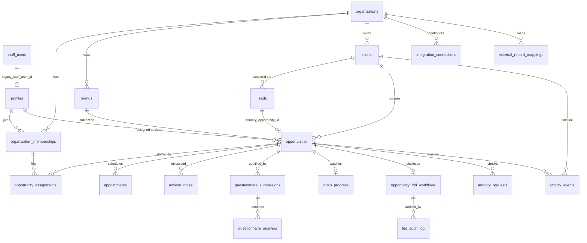

# Platform Domain Model

**Status:** Adopted (this branch) · **Scope:** multi-organization, multi-brand franchise
sales platform architecture · **Owner:** GenDev engineering

This document describes the architecture shift from the single-brand investor
qualification portal MVP to a multi-organization, multi-brand franchise sales
platform, and how the transition preserves every currently deployed behavior.

---

## 1. Current architecture (before this branch)

The MVP models everything around **one table: `public.leads`**.

- One lead = one person = one portal journey = one (implicit) franchise
  opportunity.
- `leads.portal_token` is the magic-link credential for the client portal
  (`/p/[token]`).
- The advisor pipeline stage (`leads.current_stage`), qualification result,
  FDD workflow state (`leads.fdd_*`), and appointment summary all live
  directly on the lead.
- Child tables all reference `lead_id` directly: `video_progress` (1:1),
  `questionnaire_responses` (1:1 latest snapshot), `questionnaire_submissions`
  + `questionnaire_answers` (immutable history), `appointments`,
  `advisor_notes`, `portal_events`, `fdd_audit_log`.
- Staff identity is `staff_users` (custom email+password auth, `ADMIN` /
  `ADVISOR` roles) with server-side `staff_sessions` (SHA-256 token hashes in
  HttpOnly cookies).
- The single brand is configured through environment variables and code
  defaults (`lib/config/brand.ts`, `lib/config/fdd.ts`). The active portal is
  the **CMDT (Complete Mobile Drug Testing)** opportunity operated by the
  **GenDev** FSO; the GoHighLevel location default in `lib/config/fdd.ts` is
  the CMDT sub-account.
- All data access goes through one `PortalStore` interface
  (`lib/store/types.ts`) with two implementations: `supabaseStore` (service
  role, server-only) and `devStore` (file-backed local fallback,
  production-guarded).
- RLS is enabled on every table with **no policies** (deny-all); only the
  server's service-role client reads/writes.
- GoHighLevel is the FDD dispatch + calendar integration; external IDs are
  stored in ad-hoc columns (`leads.fdd_provider_envelope_id`,
  `leads.fdd_workflow_id`, `appointments.external_appointment_id`,
  `leads.facebook_lead_id`, `leads.appointment_id`).

## 2. Target architecture

One **person (client)** can pursue **multiple brand-specific opportunities**
inside an **organization**, worked by multiple authorized team members.

Distinct concepts, each with its own table:

| Concept | Table | Notes |
| --- | --- | --- |
| Authentication identity | (future Supabase Auth) `profiles.auth_user_id` | not created in this phase |
| User profile | `profiles` | application-level person-with-access record |
| Organization | `organizations` | tenant boundary (GenDev is the first) |
| Organization membership | `organization_memberships` | profile ↔ org with role + status |
| Client/person | `clients` | canonical prospective franchise buyer |
| Lead/acquisition record | `leads` (existing) | marketing acquisition + portal-entry record |
| Franchise brand | `brands` | brand catalog per organization |
| Opportunity | `opportunities` | one client × one brand sales journey — the new center |
| Advisor assignment | `opportunities.assigned_advisor_profile_id` + `opportunity_assignments` | primary column for reads, M:N table for teams |
| Activity/event | `activity_events` (new) + `portal_events` (legacy, kept) | centralized event service dual-writes |
| Appointment | `appointments` (existing, extended) | gains org/client/opportunity links |
| Questionnaire submission | `questionnaire_submissions` (existing, extended) | immutable history, gains opportunity links |
| FDD workflow | `opportunity_fdd_workflows` (new) + `leads.fdd_*` (legacy, synced) | opportunity-scoped |
| Territory request | `territory_requests` (new, foundation only) | opportunity-scoped |
| External CRM identity | `external_record_mappings` + `integration_connections` | provider IDs never primary keys |

## 3. Entity relationships

Cardinality rules:

- An opportunity belongs to exactly one client, one organization, one brand.
- A brand belongs to one organization (optionally linked to a developer org).
- A client belongs to one organization; the same human may exist as separate
  client rows in different organizations (deliberate — no cross-tenant merge).
- A lead points at its client and its **primary opportunity** for backward
  compatibility. Lead-sourced opportunities are 1:1 with their source lead
  (enforced by a partial unique index on `opportunities.source_lead_id`);
  additional opportunities for the same client are created directly without a
  source lead.
- A client may have any number of opportunities, including for the same brand
  at different times (no global client+brand uniqueness — revisits are legal).

## 4. Backward-compatibility strategy

Non-negotiables preserved:

- **No column, table, route, or response field is removed or renamed.**
- `portal_token` values are unchanged; `/p/[token]` still resolves via the
  lead first, then loads the new context around it.
- All existing API response shapes are additive-only.
- `leads.fdd_*`, `leads.current_stage`, `leads.assigned_advisor_id` continue
  to be written (see dual-write below) so any not-yet-migrated reader keeps
  working.
- The existing `PortalStore` methods keep their exact signatures; new methods
  are added alongside.

**Runtime repair (`ensureLeadDomainChain`)**: any code path that needs the new
context (portal load, advisor detail, FDD action) resolves the lead's
organization/client/opportunity and **creates the missing pieces on demand**
using the same deterministic rules as the SQL backfill. This means the app is
correct even if a lead was created before the backfill ran, and the local dev
store (which has no SQL migrations) converges to the same shape.

## 5. Data migration strategy

Two new sequential migrations, both additive and idempotent:

- **`0005_platform_domain.sql`** — creates all new tables, additive columns on
  existing tables, indexes, constraints, RLS enablement, and policy helper
  functions. Every statement is `if not exists` / guarded.
- **`0006_platform_backfill.sql`** — deterministic, rerunnable backfill:
  1. Upsert the **GenDev** organization (`slug = 'gendev'`, type `FSO`).
  2. Upsert the **default brand** (`slug = 'default'`, name
     "GenDev Compass Default Brand", status `active`,
     `brand_settings.requires_configuration = true`). Migrations cannot read
     env vars, so the brand is created as a documented placeholder for the
     administrator to rename (the running app identifies the portal brand via
     `DEFAULT_BRAND_SLUG`, default `default`).
  3. One `profiles` row per `staff_users` row (linked via
     `legacy_staff_user_id`, unique).
  4. One GenDev membership per profile (`ADMIN → ORGANIZATION_ADMIN`,
     `ADVISOR → ADVISOR`).
  5. One `clients` row per lead (provenance via `clients.source_lead_id`,
     unique — reruns cannot duplicate).
  6. One `opportunities` row per lead (provenance via
     `opportunities.source_lead_id`, partial unique index), copying
     `current_stage`, qualification fields, `last_activity_at`, and mapping
     `assigned_advisor_id → assigned_advisor_profile_id`.
  7. Link `leads.organization_id / client_id / primary_opportunity_id /
     brand_id`.
  8. Backfill org/client/opportunity links onto `appointments`,
     `advisor_notes`, `questionnaire_submissions`, `questionnaire_responses`,
     `video_progress`, `fdd_audit_log`.
  9. One `opportunity_fdd_workflows` row per opportunity whose lead has
     `fdd_status <> 'not_requested'` (unique per opportunity).
  10. Copy `portal_events` into `activity_events`
      (`legacy_portal_event_id` unique — reruns cannot duplicate).

Every step is `insert … select … where not exists` or `on conflict do
nothing` against a uniqueness key, so the migration can run any number of
times against any environment, including an empty database.

The new link columns stay **nullable** — local/preview environments and rows
created mid-deploy must not break inserts. Application code treats a missing
link as "repair me" (see §4), not as an error.

## 6. Authentication strategy

- The custom `staff_users` + `staff_sessions` system **remains the working
  authentication** for this phase. It is *transitional*: the target is
  Supabase Auth, but migrating logins is explicitly out of scope here.
- `profiles` is the bridge: `legacy_staff_user_id` links today's staff users;
  `auth_user_id` (nullable, unique) is reserved for Supabase Auth later.
- Password hashes stay in `staff_users` only. Profiles never store secrets.
- Session resolution: `staff session cookie → staff_sessions → staff_users →
  profiles (via legacy_staff_user_id) → organization_memberships`. The
  adapter (`resolveAdvisorContext`) creates the profile + GenDev membership on
  demand if the backfill hasn't run for that user.
- Clients do not authenticate in this phase — magic-link portal tokens remain.
  `clients.profile_id` is the future hook for client logins.

## 7. Authorization strategy

- All advisor routes already verify the session server-side; on top of that
  the new helpers authorize through **membership**, not through the staff
  role label alone:
  - `requireAuthenticatedProfile()` — session → profile.
  - `requireOrganizationMembership(profile, orgId)` — active membership row.
  - `requireOrganizationRole(membership, roles)` — role check.
  - `canAccessOpportunity(ctx, opportunity)` — org match + assignment rules.
- The legacy `ADVISOR_SEES_ALL` pilot behavior is preserved *within an
  organization*; it never crosses organizations.
- `ADMIN` staff role maps to `ORGANIZATION_ADMIN` of GenDev — it is **not**
  platform-wide access. A future `PLATFORM_ADMIN` membership role exists in
  the vocabulary but no code path grants cross-org access in this phase.
- Client-supplied organization/brand/advisor/opportunity IDs are never
  trusted: routes resolve them server-side and verify org scope.

## 8. Multi-tenant strategy

- Every new table carries `organization_id` (directly or through a required
  parent). `opportunities`, `clients`, `brands`, `activity_events`,
  `territory_requests`, `external_record_mappings`,
  `integration_connections`, `opportunity_fdd_workflows` are all org-scoped.
- Org isolation is enforced in three layers:
  1. Server routes check membership before touching org data.
  2. Service functions take the acting membership/organization as input.
  3. RLS policies (see `multi-tenant-security.md`) scope future
     authenticated access by active membership; today's deny-all posture is
     unchanged for anonymous/authenticated browser access because the app
     uses the service role server-side.
- Platform-level records (none yet) would use the `PLATFORM` organization
  type deliberately, never `NULL` org IDs.

## 9. Source-of-truth decisions

| Data | Source of truth (target) | Legacy location (kept in sync) |
| --- | --- | --- |
| Person identity | `clients` | `leads` name/email/phone columns |
| Acquisition/attribution | `leads` (permanent role) | — |
| Pipeline stage | `opportunities.stage` | `leads.current_stage` |
| Qualification | `opportunities.qualification_*` (copied at backfill; new writes dual-write) | `leads.qualification_*` |
| Latest questionnaire snapshot | `questionnaire_responses` (unchanged, 1:1 with lead/primary opportunity) | — |
| Immutable questionnaire history | `questionnaire_submissions` + `questionnaire_answers` (now opportunity-linked) | — |
| FDD state | `opportunity_fdd_workflows` | `leads.fdd_*` |
| FDD history | `fdd_audit_log` (immutable, now also opportunity-linked) | — |
| Advisor assignment | `opportunities.assigned_advisor_profile_id` (+ `opportunity_assignments`) | `leads.assigned_advisor_id` |
| Events | `activity_events` via the central activity service | `portal_events` (still written) |
| External IDs | `external_record_mappings` | legacy columns (`fdd_provider_envelope_id`, `external_appointment_id`, `facebook_lead_id`, …) |

**Dual-write direction (no loops):** all writes flow through one service per
domain (stage service, FDD service, activity service). The service writes the
**opportunity-level record and the legacy lead fields in the same call**.
There are no database triggers and no reverse synchronization — the lead
columns are write-through mirrors for the lead's *primary* opportunity only.

## 10. Legacy fields that remain temporarily

- `leads.current_stage`, `leads.assigned_advisor_id`, `leads.last_activity_at`
- `leads.qualification_score/result/reasons`
- `leads.fdd_*` (all eleven columns)
- `leads.appointment_id`, `leads.appointment_start_at`
- `appointments.lead_id`, `appointments.advisor_id`
- `advisor_notes.lead_id`, `advisor_notes.staff_user_id`
- `questionnaire_*.lead_id`, `video_progress.lead_id` (+ its `lead_id` unique
  constraint)
- `portal_events` as a written table
- `staff_users` / `staff_sessions` as the authentication system

## 11. Future deprecation plan

See `legacy-deprecation-roadmap.md`. Summary: nothing is removed until (a)
all readers use the opportunity-level source of truth, (b) Supabase Auth
migration completes for staff, and (c) a full audit confirms parity. `leads`
itself is **never** dropped — it remains the permanent acquisition record.
`fdd_audit_log` and `questionnaire_submissions` are legally significant and
remain indefinitely.

## 12. Known risks and open questions

- **Atomicity:** `@supabase/supabase-js` cannot run multi-statement
  transactions. Lead intake creates the chain sequentially with logged,
  repairable failure modes (`ensureLeadDomainChain` heals partial chains).
  A future `create_lead_domain_chain` Postgres function could make this
  atomic; deferred to keep this phase reviewable.
- **Default brand naming:** migrations cannot read env config, so the seeded
  brand is a documented placeholder (`slug = 'default'`). An administrator
  should rename it (or create the real CMDT brand and repoint
  `DEFAULT_BRAND_SLUG`) after applying migrations. The app works either way.
- **Email uniqueness on profiles:** profiles mirror `staff_users.email`
  (globally unique today). Profiles enforce **case-insensitive uniqueness**
  via a functional unique index; documented as a platform-level decision
  (one profile per email across the platform, memberships give org access).
- **Event volume:** `activity_events` duplicates `portal_events` during the
  transition (single insert path in the activity service, marked by
  `legacy_portal_event_id` for backfilled rows). Storage is cheap; correctness
  of the ordering (`occurred_at` fallback `created_at`) is tested.
- **Dev-store divergence:** the file-backed store implements the new
  interfaces in-process rather than via SQL; the shared `PortalStore`
  interface plus the domain-chain tests keep the two behaviorally aligned.
- **Open:** whether advisors should be restricted per-brand within an org
  (not modeled yet — `opportunity_assignments` covers per-deal teams; brand
  scoping would be a follow-up membership attribute).

## 13. Explicit architecture decisions

1. **Is `leads` the acquisition record while `clients` is the canonical
   person?** Yes. `leads` permanently records how a person arrived (source,
   campaign, portal token); `clients` is the canonical person within an
   organization. `clients.source_lead_id` records provenance.
2. **Is `opportunities` the canonical home for brand-specific pipeline
   stages?** Yes. `leads.current_stage` is a synchronized mirror of the
   lead's *primary* opportunity only, maintained by the stage service.
3. **Where does qualification live?** On the opportunity
   (`qualification_score/result/reasons`), dual-written to the legacy lead
   columns at submission time. Qualification is brand-specific by nature.
4. **Where does the current/latest questionnaire snapshot live?**
   `questionnaire_responses` (1:1 with the lead, now opportunity-linked) —
   unchanged portal behavior.
5. **Where does immutable questionnaire history live?**
   `questionnaire_submissions` + `questionnaire_answers`, append-only, now
   linked to organization/client/opportunity/brand.
6. **Where does FDD state live?** `opportunity_fdd_workflows` (one row per
   opportunity); `fdd_audit_log` remains the immutable history with added
   opportunity/workflow links.
7. **How are legacy `leads.fdd_*` values synchronized?** One direction only:
   the FDD engine writes the lead mirror first, then
   `syncFddWorkflowFromLead` projects it onto the workflow row. Nothing
   writes lead FDD fields from the workflow. No triggers.
8. **How does a staff session resolve to a profile?**
   `staff_sessions → staff_users → profiles.legacy_staff_user_id`, via
   `resolveAdvisorContext` (get-or-create so pre-backfill environments
   converge).
9. **How is organization access enforced?** Server-side, through active
   `organization_memberships` (`canAccessOrganization` /
   `requireOrganizationMembership`); RLS policies enforce the same rule for
   future direct authenticated access.
10. **How is a default brand selected for current portal links?** By slug:
    `DEFAULT_BRAND_SLUG` (default `default`) within the default organization
    (`DEFAULT_ORGANIZATION_SLUG`, default `gendev`), created on demand as a
    placeholder flagged `requires_configuration`.
11. **How are duplicate clients detected without unsafe merging?**
    `findDuplicateCandidates` surfaces same-organization case-insensitive
    email matches as *candidates*; nothing ever merges automatically.
12. **How are GoHighLevel contact IDs stored?** In
    `external_record_mappings` (provider `gohighlevel`, entity type
    `client`), registered at intake when `externalContactId` is supplied.
13. **How are GoHighLevel opportunity IDs stored?** Same table, entity type
    `opportunity`, via `externalOpportunityId` at intake or the mapping
    service later.
14. **How are provider webhook events deduplicated?** FDD: external event
    IDs in the immutable `fdd_audit_log` (unchanged). Activity events: a
    partial unique index on (organization, event_source, external_event_id)
    plus `hasActivityExternalEvent`. Calendar: appointment upsert by
    `external_appointment_id` plus a composed activity external ID.
15. **How does the local datastore emulate the new model?** The file-backed
    dev store implements every new `PortalStore` method with the same
    uniqueness semantics as the SQL constraints; `ensureLeadDomainChain`
    gives it the same backfill behavior at runtime.
16. **What is the migration path to Supabase Auth?** Documented in
    `authentication-authorization.md`: invite-based auth user creation, link
    `profiles.auth_user_id`, swap session resolution behind
    `resolveAdvisorContext`, retire custom sessions. Not executed now.
17. **What can be safely deprecated later?** See
    `legacy-deprecation-roadmap.md`: lead mirror fields, custom sessions,
    portal_events dual-write — each gated on parity monitoring.
18. **What must remain indefinitely?** `leads` (with unchanged
    `portal_token`s), `fdd_audit_log`, `questionnaire_submissions/answers`,
    and historical event rows — legal and audit requirements.
